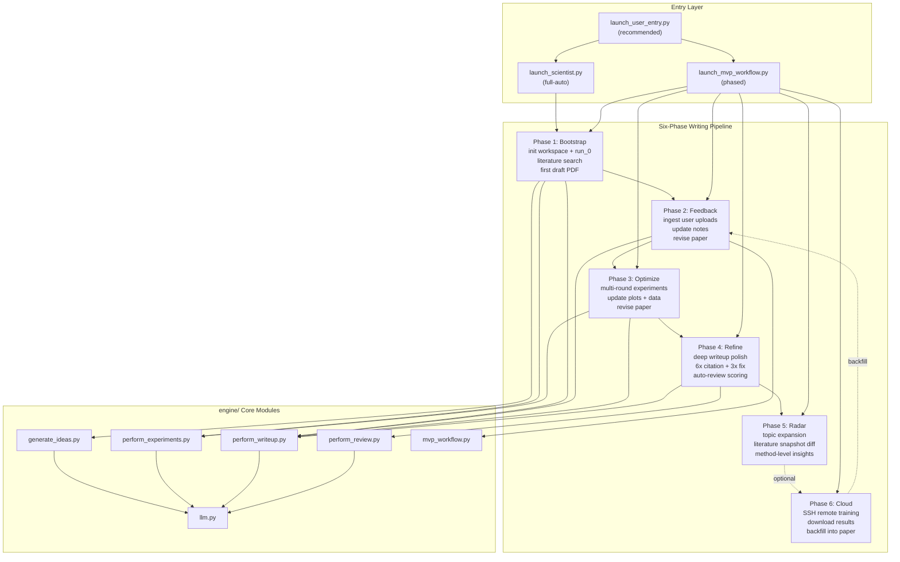
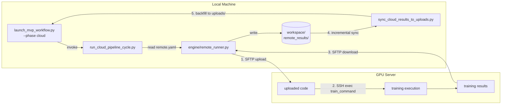
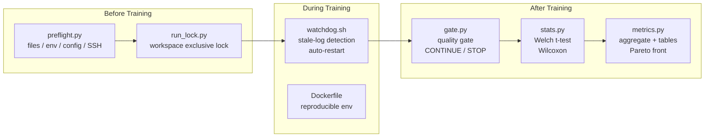
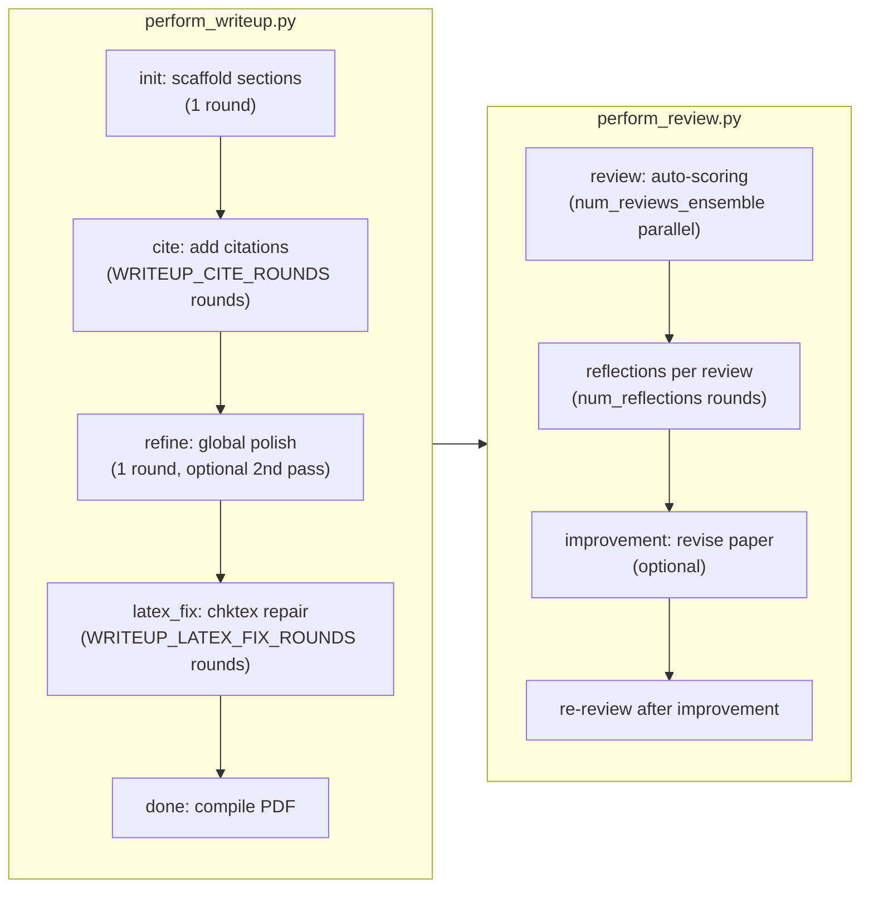

# PaperForge

**Iterative academic paper writing powered by LLMs, with built-in experiment infrastructure.**

PaperForge automates the full lifecycle of academic paper generation — from idea creation and experiment execution to iterative writing, citation integration, and self-review — using a closed-loop, multi-phase pipeline driven by large language models. It includes production-grade experiment tooling: SSH remote execution, quality gates, statistical significance testing, training watchdog, and pre-flight validation.

> **Acknowledgement**: PaperForge is a derivative work of [The AI Scientist](https://github.com/SakanaAI/AI-Scientist) by Sakana AI. The upstream code is licensed under The AI Scientist Source Code License (see [LICENSE-UPSTREAM](LICENSE-UPSTREAM)). PaperForge adds multi-phase workflow orchestration, SSH remote execution with result backfill, anti-AI-detection writing style, and production experiment infrastructure on top of the original framework.
>
> **Mandatory Disclosure**: Any scientific manuscript generated using PaperForge **must** prominently disclose AI involvement (e.g., in the abstract or a dedicated disclosure section), as required by the upstream license.

## Features

### Paper Writing Pipeline
- **Multi-phase pipeline**: `bootstrap → feedback → optimize → refine → radar → cloud` with persistent workspace state and checkpoint/resume
- **Multi-model routing**: assign different LLMs per stage (idea / code / writeup / review)
- **Dual protocol support**: Anthropic native API and OpenAI-compatible API (including third-party gateways)
- **Literature search integration**: OpenAlex and Semantic Scholar queries feed directly into writing context
- **Literature radar**: seed-topic expansion + snapshot diff + method-level next-idea report for find/read/review workflows
- **Prompt caching**: Anthropic prompt caching reduces token cost across multi-turn writing sessions
- **Anti-AI-detection style control**: customizable prompt library with 20+ academic writing prompts
- **LaTeX sanitization**: automatic cleanup of stylistic artifacts and formatting inconsistencies in generated `.tex` files

### Experiment Infrastructure
- **SSH remote execution**: upload code to GPU server, run training, download results — all via `remote.yaml`
- **Cloud result backfill**: sync remote/server outputs into the writing workspace with incremental diff
- **Quality gate**: configurable metric thresholds auto-decide whether to proceed or stop (JSON/MD reports)
- **Statistical significance**: Welch t-test, Wilcoxon signed-rank, compare-to-baseline for ablation studies
- **Metrics aggregation**: mean/stderr/min/max across seeds, Markdown and LaTeX table generation, Pareto front
- **Workspace locking**: fcntl-based exclusive lock prevents concurrent write conflicts
- **Pre-flight validation**: verify files, environment, configs, SSH keys before wasting GPU hours
- **Training watchdog**: auto-detect stale training and restart with resume
- **Docker support**: reproducible training environment with GPU + LaTeX

## Recommended Model Routing Strategy

PaperForge supports multi-model routing — assigning different LLMs to different pipeline stages for optimal results. Below is a recommended configuration based on each model's strengths:

| Pipeline Stage | Recommended Model | Rationale |
|---------------|-------------------|-----------|
| **Idea Generation** (creative / novel viewpoints) | **Grok** | Excels at divergent thinking and generating unconventional, creative research angles |
| **Innovation Validation** (reasoning / feasibility check) | **Gemini** | Strong logical reasoning capabilities; ideal for verifying whether a proposed innovation is theoretically sound and practically feasible |
| **Paper Writing** (formal academic prose) | **Claude** | Produces the most natural, human-like academic writing with nuanced expression and consistent style |
| **Code Generation** (experiment implementation) | **GPT Codex** | Supports the longest context window (up to 200k+ tokens), enabling continuous, uninterrupted coding sessions across large codebases |

**Example `key.sh` configuration:**

```bash
# Idea model → Grok (via OpenAI-compatible API)
export OPENAI_API_KEY='your-grok-api-key'
export OPENAI_BASE_URL='https://api.x.ai/v1'

# Writeup model → Claude (Anthropic native)
export ANTHROPIC_API_KEY='your-anthropic-key'

# Code model → GPT Codex (OpenAI)
export OPENAI_WRITEUP_API_KEY='your-openai-key'
export OPENAI_WRITEUP_BASE_URL='https://api.openai.com/v1'
```

> **Tip**: You can also use `launch_user_entry.py` to interactively assign models per stage, or pass `--idea-model`, `--code-model`, `--writeup-model`, `--review-model` flags to `launch_scientist.py`.

## Architecture

### Overview: Entry Points and Six-Phase Pipeline



### SSH Remote Execution and Result Backfill



### Experiment Infrastructure



### End-to-End Data Flow

```mermaid
flowchart TB
    START([User starts PaperForge])
    START --> PREFLIGHT["preflight.py<br/>validate environment"]
    PREFLIGHT --> BOOT

    subgraph p1 [Phase 1: Bootstrap]
        BOOT["create workspace from template"]
        BOOT --> IDEA["generate_ideas.py<br/>LLM generates research idea"]
        IDEA --> EXP1["perform_experiments.py<br/>aider runs experiment.py"]
        EXP1 --> PLOT1["plot.py<br/>generate figures"]
        PLOT1 --> LIT["literature search<br/>OpenAlex / Semantic Scholar"]
        LIT --> WRITE1["perform_writeup.py<br/>first draft"]
        WRITE1 --> PDF1(["paper_mvp_draft.pdf"])
    end

    subgraph p2 [Phase 2: Feedback]
        UPLOAD["user uploads to workspace/uploads/"]
        UPLOAD --> INGEST["ingest_user_uploads"]
        INGEST --> NOTES["update notes.txt"]
        NOTES --> WRITE2["perform_writeup.py<br/>revise paper"]
        WRITE2 --> PDF2(["paper_with_feedback.pdf"])
    end

    subgraph p3 [Phase 3: Optimize]
        EXP2["run_experiment_once x N"]
        EXP2 --> PLOT2["update plots"]
        PLOT2 --> WRITE3["perform_writeup.py"]
        WRITE3 --> PDF3(["paper_after_optimize.pdf"])
    end

    subgraph p4 [Phase 4: Refine]
        WRITE4["perform_writeup.py<br/>deep profile"]
        WRITE4 --> REVIEW["perform_review.py<br/>auto-review scoring"]
        REVIEW --> PDF4(["paper_refined.pdf"])
    end

    subgraph p5 [Phase 5: Cloud]
        SSH["remote_runner.py<br/>SFTP upload to server"]
        SSH --> RTRAIN["server-side training"]
        RTRAIN --> DL["SFTP download results"]
        DL --> BSYNC["sync_cloud_results_to_uploads.py"]
        BSYNC --> GATE["gate.py<br/>quality gate"]
    end

    PDF1 --> UPLOAD
    PDF2 --> EXP2
    PDF3 --> WRITE4
    PDF4 --> SSH
    GATE -->|CONTINUE| UPLOAD
    GATE -->|STOP| FINAL(["Final paper + stats report"])
    PDF4 --> FINAL

    FINAL --> STATS["stats.py<br/>significance tests"]
    STATS --> TABLES["metrics.py<br/>LaTeX / Markdown tables"]
```



## Project Structure

```
PaperForge/
├── engine/                        # Core engine modules
│   ├── __init__.py
│   ├── generate_ideas.py          # Idea generation + novelty check
│   ├── llm.py                     # LLM client factory (Anthropic / OpenAI / compatible)
│   ├── mvp_workflow.py            # Workspace creation, experiment runs, notes, uploads
│   ├── perform_experiments.py     # Experiment execution via aider
│   ├── perform_review.py          # Auto-review scoring
│   ├── perform_writeup.py         # Multi-round writeup with citation + LaTeX fix
│   ├── remote_runner.py           # SSH remote execution (upload / train / download)
│   ├── run_lock.py                # fcntl workspace lock (concurrent write protection)
│   ├── metrics.py                 # Aggregation, Markdown/LaTeX tables, Pareto front
│   ├── stats.py                   # Statistical significance tests (Welch, Wilcoxon)
│   ├── gate.py                    # Metric-based quality gate with JSON/MD output
│   ├── preflight.py               # Pre-flight validation (files, env, config, SSH)
│   └── fewshot_examples/          # Review few-shot examples (JSON + PDF + TXT)
├── templates/
│   └── paper_writer/              # Default template
│       ├── experiment.py           # Baseline experiment script
│       ├── plot.py                 # Visualization script
│       ├── latex/                  # LaTeX template + styles
│       └── run_0/                  # Baseline run data
├── workspace/
│   └── results/                   # Runtime outputs (git-ignored)
│
├── launch_user_entry.py           # Unified entry point (recommended)
├── launch_scientist.py            # Full-auto pipeline (idea → writeup → review)
├── launch_mvp_workflow.py         # Phased pipeline (bootstrap/feedback/optimize/refine/radar/cloud)
├── run_cloud_pipeline_cycle.py    # Cloud cycle: SSH remote + local pipeline + sync
├── sync_cloud_results_to_uploads.py  # Incremental result ingestion
├── prompt_library.py              # 20+ academic writing prompts (anti-AI-detection)
├── watchdog.sh                    # Training auto-heal watchdog
│
├── CODE_AGENT_PROMPT.md           # Six-phase code agent protocol
├── remote.example.yaml            # SSH remote config template
├── key.example.sh                 # API key template
├── Dockerfile                     # Reproducible GPU + LaTeX environment
├── requirements.txt
├── .gitignore
├── LICENSE                        # PaperForge License (non-commercial + upstream restrictions)
└── LICENSE-UPSTREAM               # The AI Scientist Source Code License (Sakana AI)
```

## Quick Start

### 1. Setup

```bash
git clone https://github.com/<YOUR_USERNAME>/PaperForge.git
cd PaperForge
python -m venv .venv
source .venv/bin/activate
pip install -r requirements.txt
```

### 2. Configure API Keys

```bash
cp key.example.sh key.sh
# Edit key.sh with your actual API keys
source ./key.sh
```

### 3. Pre-flight Check

```bash
python -m engine.preflight --workspace ./workspace
```

### 4. Run

**One-command full pipeline** (idea → experiment → writeup → review):

```bash
python launch_scientist.py \
  --experiment paper_writer \
  --num-ideas 1 \
  --skip-novelty-check
```

Outputs are created under `workspace/results/<experiment>/<timestamp_idea>/`.

**Phased pipeline** (step by step):

```bash
# Bootstrap: initialize workspace + first draft
python launch_mvp_workflow.py --phase bootstrap --experiment paper_writer --engine openalex

# Feedback: ingest uploads and revise
python launch_mvp_workflow.py --phase feedback --run-dir workspace/results/paper_writer/<WS>

# Optimize: add experiments and update paper
python launch_mvp_workflow.py --phase optimize --run-dir workspace/results/paper_writer/<WS>

# Refine: final polish
python launch_mvp_workflow.py --phase refine --run-dir workspace/results/paper_writer/<WS>

# Radar: periodic literature scouting + method-level next ideas
python launch_mvp_workflow.py --phase radar --run-dir workspace/results/paper_writer/<WS> --radar-seed "CTA strategy" --year-min 2010 --year-max 2026

# Cloud: SSH remote execution + result backfill
python launch_mvp_workflow.py --phase cloud --run-dir workspace/results/paper_writer/<WS> --remote-config remote.yaml
```

**Run all phases at once:**

```bash
python launch_mvp_workflow.py --phase all --experiment paper_writer
```

Year filters: prefer `--year-min/--year-max`. Legacy `--literature-year-after/--literature-year-before` remains compatible.

### Docker

```bash
docker build -t paperforge .
docker run --gpus all -v $(pwd)/workspace:/workspace/workspace paperforge
```

## Unified Entry Point

`launch_user_entry.py` combines protocol selection, per-stage model routing, and pipeline launch.

| Stage | Flag | Purpose |
| --- | --- | --- |
| Idea generation | `--idea-model` | Controls `generate_ideas` and novelty search |
| Experiment / code | `--code-model` | Controls `experiment.py` / `plot.py` iterations |
| Paper writing | `--writeup-model` | Controls writeup and citation rounds |
| Auto-review | `--review-model` | Controls reviewer model |
| Default fallback | `--model` | Used when a stage-specific model is not set |

## Remote Execution (SSH)

Upload code → train on GPU server → download results, all automated.

```bash
cp remote.example.yaml remote.yaml  # edit with your server details
python -m engine.preflight --remote-config remote.yaml  # validate before use

# Standalone test
python -m engine.remote_runner --config remote.yaml --download-dir ./remote_results

# Within pipeline
python launch_mvp_workflow.py --phase cloud --run-dir <WS> --remote-config remote.yaml
```

Supports `--upload-only`, `--exec-only`, `--download-only` for partial operations.

### Config Reference (`remote.yaml`)

| Key | Description |
| --- | --- |
| `host` | SSH hostname/IP (required) |
| `port` | SSH port (default: 22) |
| `username` | SSH user (default: root) |
| `auth.method` | `key` or `password` |
| `auth.key_path` | Path to SSH private key |
| `auth.passphrase` | Key passphrase (supports `$ENV_VAR`) |
| `auth.password` | Password (supports `$ENV_VAR`) |
| `remote_workdir` | Remote working directory |
| `upload_paths` | Local files/dirs to upload |
| `train_command` | Shell command on server (required) |
| `results_dir` | Remote results directory (required) |
| `connect_timeout` | Connection timeout seconds (default: 15) |

## Quality Gate

Automatically decide whether experiment results meet a threshold:

```python
from engine.gate import GateConfig, evaluate_gate

cfg = GateConfig(
    metric_key="mAP50_95",
    target_mean_min=0.885,
    target_any_seed_min=0.90,
    seed_std_max=0.010,
)
decision = evaluate_gate(seed_values=[0.87, 0.89, 0.88], config=cfg)
decision.save("./workspace/results/gate/")
```

Outputs `gate_decision.json` and `gate_decision.md` with action, thresholds, and details.

| Action | Meaning |
| --- | --- |
| `CONTINUE` | Gate passed, proceed to next phase |
| `STOP_BELOW_TARGET` | Metric below threshold |
| `STOP_HIGH_VARIANCE` | Seed variance too high |
| `STOP_STILL_IMPROVING` | Tail-gain suggests more epochs needed |
| `STOP_NO_DATA` | No valid results to evaluate |

## Statistical Significance Testing

For ablation studies in papers:

```python
from engine.stats import compare_to_baseline

results = compare_to_baseline(
    rows=experiment_rows,
    metric_key="mAP50_95",
    baseline_name="baseline",
    group_key="ablation",
    alpha=0.05,
)
# Returns: group, mean, std, delta_vs_baseline, test_name, p_value, significant
```

Available tests: Welch's t-test (default), Wilcoxon signed-rank, exact sign test (fallback).

## Metrics & Tables

```python
from engine.metrics import aggregate_numeric, to_markdown_table, to_latex_table, pareto_front

# Aggregate across seeds
agg = aggregate_numeric(seed_rows)

# Generate paper-ready tables
md = to_markdown_table(summary_rows)
tex = to_latex_table(summary_rows, caption="Ablation Results", label="tab:ablation")

# Pareto front (e.g. latency vs accuracy)
front = pareto_front(rows, x_key="latency_ms", y_key="mAP50_95")
```

## Training Watchdog

Auto-detect and restart stale training:

```bash
# Start watchdog
TRAIN_CMD="python experiment.py --resume" \
TRAIN_LOG="./train.log" \
STALE_THRESHOLD_SEC=900 \
  bash watchdog.sh start

# Check status / stop
bash watchdog.sh status
bash watchdog.sh stop
```

## Pre-flight Validation

Catch issues before wasting GPU time:

```bash
# Basic check
python -m engine.preflight --workspace ./workspace/results/my_exp

# Full check with remote config
python -m engine.preflight \
  --workspace ./workspace/results/my_exp \
  --remote-config remote.yaml \
  --require-files experiment.py plot.py latex/template.tex
```

Checks: Python version, virtualenv, GPU, required files, YAML config values, SSH key existence.

## Workspace Locking

Prevent concurrent processes from corrupting workspace files:

```python
from pathlib import Path
from engine.run_lock import run_lock

with run_lock(Path("workspace/results/my_exp"), timeout=30):
    # safe to write to workspace
    ...
```

## Environment Variables

### Writeup Controls

| Variable | Default | Description |
| --- | --- | --- |
| `WRITEUP_CITE_ROUNDS` | `3` | Citation-add rounds |
| `WRITEUP_LATEX_FIX_ROUNDS` | `2` | LaTeX/chktex fix rounds |
| `WRITEUP_SECOND_REFINEMENT` | `0` | Second global refinement pass |
| `WRITEUP_ENABLE_CHECKPOINT` | `1` | Writeup checkpoint/resume |
| `WRITEUP_RESET_CHECKPOINT` | `0` | Clear old checkpoints |

### Model & Protocol

| Variable | Default | Description |
| --- | --- | --- |
| `PAPERFORGE_CLAUDE_OPENAI_COMPAT` | `0` | Route Claude via OpenAI-compatible endpoint |
| `PAPERFORGE_ANTHROPIC_PROMPT_CACHE` | `1` | Enable Anthropic prompt caching |
| `PAPERFORGE_OPENAI_COMPAT_MAX_TOKENS` | `4096` | Default max_tokens for OpenAI compat |
| `PAPERFORGE_AIDER_EDIT_FORMAT` | `udiff` | Aider edit format |

### Other

| Variable | Default | Description |
| --- | --- | --- |
| `PAPERFORGE_ALLOW_SYSTEM_PYTHON` | `0` | Bypass virtualenv check |
| `PAPERFORGE_DEBUG_HTTP` | `0` | Print literature HTTP responses |
| `PAPERFORGE_PROMPT_LIBRARY_PATH` | `prompt_library.py` | Custom prompt library |

## Iteration & Cost Control

PaperForge controls API cost by limiting iteration rounds at every stage. The table below shows the **original upstream defaults** (very expensive), the **PaperForge defaults** (cost-optimized), and the **recommended production values** tested by the author.

### Writeup Iteration Parameters



### Full Parameter Reference

| Parameter | Where | Original Upstream | PaperForge Default | Recommended | Override Method |
| --- | --- | --- | --- | --- | --- |
| **Citation rounds** | `perform_writeup` | 20 | 3 | **4** | `WRITEUP_CITE_ROUNDS` env var |
| **LaTeX fix rounds** | `perform_writeup` | 5 | 2 | **2** | `WRITEUP_LATEX_FIX_ROUNDS` env var |
| **Second refinement** | `perform_writeup` | on | off | **off** | `WRITEUP_SECOND_REFINEMENT` (0/1) |
| **Checkpoint/resume** | `perform_writeup` | N/A | on | **on** | `WRITEUP_ENABLE_CHECKPOINT` (0/1) |
| **Reset checkpoint** | `perform_writeup` | N/A | off | **off** | `WRITEUP_RESET_CHECKPOINT` (0/1) |
| **Review reflections** | `perform_review` | 5 | 5 | **5** | hardcoded in `launch_scientist.py` |
| **Review ensemble size** | `perform_review` | 5 | 5 | **5** | hardcoded in `launch_scientist.py` |
| **Few-shot examples** | `perform_review` | 1 | 1 | **1** | hardcoded in `launch_scientist.py` |
| **Idea reflections** | `generate_ideas` | 5 | 3 | **3** | `NUM_REFLECTIONS` in `launch_scientist.py` |
| **Max ideas** | `generate_ideas` | 50 | 50 | **1-3** | `--num-ideas` CLI arg |
| **Novelty check rounds** | `generate_ideas` | 10 | 10 | **10** | hardcoded |
| **Optimize runs** | `launch_mvp_workflow` | N/A | 2 | **2** | `--optimize-runs` CLI arg |
| **Opus retry rounds** | `llm.py` | 3 | 3 | **3** | `ANTHROPIC_OPUS_RETRY_ROUNDS` env var |

### Cost Estimation by Profile

Each "round" = one LLM API call (typically 2k-8k input tokens + 1k-4k output tokens).

| Profile | Cite Rounds | LaTeX Fix | 2nd Refinement | Review | Est. Total LLM Calls | Est. Cost (Claude Sonnet) |
| --- | --- | --- | --- | --- | --- | --- |
| `fast` | 2 | 1 | off | 5 | ~15-20 | ~$0.5-1.0 |
| `balanced` | 3 | 2 | off | 5 | ~20-25 | ~$1.0-2.0 |
| `deep` | 6 | 3 | on | 5 | ~35-45 | ~$3.0-5.0 |
| **recommended** | **4** | **2** | **off** | **5** | ~22-28 | ~$1.5-2.5 |
| original upstream | 20 | 5 | on | 5 | ~60-80 | ~$8-15 |

### Recommended `key.sh` Settings

```bash
# Cost-optimized writeup controls (tested by author)
export WRITEUP_CITE_ROUNDS='4'
export WRITEUP_LATEX_FIX_ROUNDS='2'
export WRITEUP_SECOND_REFINEMENT='0'
```

These values strike the best balance: citation coverage is good enough for 15-25 references, LaTeX errors are caught in 2 passes, and the expensive second-refinement pass is skipped (it adds ~30% cost for marginal quality improvement).

## Refine Profiles

The `--refine-profile` flag controls writing iteration intensity via environment variable presets:

| Profile | `WRITEUP_CITE_ROUNDS` | `WRITEUP_LATEX_FIX_ROUNDS` | `WRITEUP_SECOND_REFINEMENT` | Use Case |
| --- | --- | --- | --- | --- |
| `fast` | 2 | 1 | off | Quick drafts, iteration testing |
| `balanced` | 3 | 2 | off | Default for most papers |
| `deep` | 6 | 3 | on | Final submission quality |

Set via CLI:

```bash
python launch_mvp_workflow.py --phase refine --run-dir <WS> --refine-profile deep
```

## Code Agent Prompt

See [`CODE_AGENT_PROMPT.md`](CODE_AGENT_PROMPT.md) for the six-phase protocol:

1. **Claim & Design** — define research claims and experiment architecture
2. **Demo Build** — build minimal runnable prototype
3. **Paper Placeholder Sync** — insert placeholder figures/tables into LaTeX
4. **Full Code Completion** — implement production-quality experiment code
5. **Cloud Run Integration** — package for remote GPU execution
6. **Writeback Readiness** — ensure outputs are ready for paper backfill

## Requirements

- Python 3.10+
- LaTeX distribution with `pdflatex`, `bibtex`, `chktex`
- At least one LLM API key (OpenAI / Anthropic / compatible endpoint)
- `paramiko` (for SSH remote execution)
- `numpy` (for metrics and statistics)
- `torch` is optional (system degrades gracefully without GPU)

## License

This project is dual-licensed:

| License | File | Scope |
|---------|------|-------|
| **PaperForge License v1.0** | [LICENSE](LICENSE) | Non-commercial use + additional terms |
| **The AI Scientist Source Code License v1.0** | [LICENSE-UPSTREAM](LICENSE-UPSTREAM) | Inherited upstream restrictions (Sakana AI) |

**Key rules:**

- ✅ Free to copy, share, modify — for **personal and academic use**
- ✅ Must credit PaperForge and upstream project (The AI Scientist by Sakana AI)
- ✅ Must include **both** LICENSE files when redistributing
- ✅ Must **disclose AI usage** in any generated papers (mandatory, legally binding)
- ❌ **No commercial use**
- ❌ No surveillance, deceptive media, unauthorized healthcare/criminal prediction use

See [LICENSE](LICENSE) and [LICENSE-UPSTREAM](LICENSE-UPSTREAM) for full legal text.
